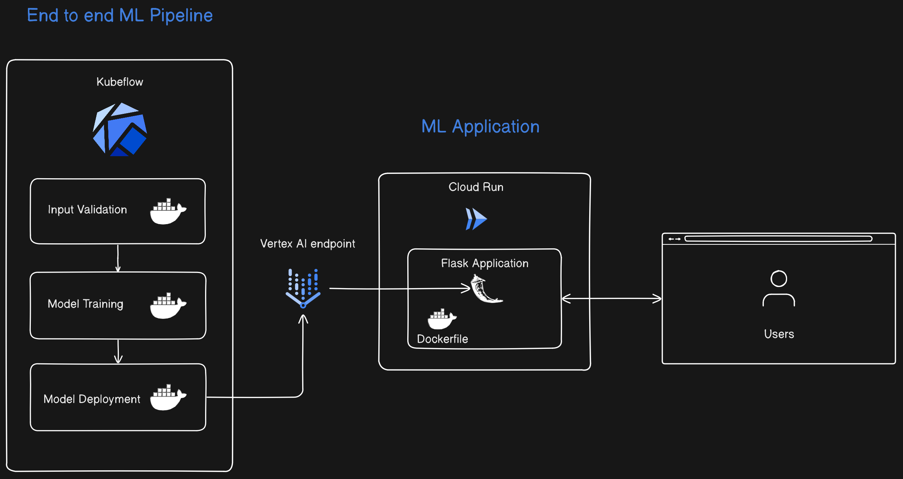

# クレジット申請審査結果予測パイプライン

このプロジェクトは、Google Cloud Vertex AIを使用してクレジット申請の審査結果を予測する機械学習パイプラインを構築するためのものです。このREADME.mdファイルでは、プロジェクトの概要、使用技術ツール、使用方法、およびセットアップ手順について説明します。

## 1. アーキテクチャ

以下にパイプライン全体のアーキテクチャ図を示します。

## 2. プロジェクト概要

このWebアプリケーションは、クレジット申請者の金融状態や個人属性に関する情報を基に、申請が「良好」（1）か「悪い」（0）かを予測する機械学習モデルを構築します。以下のステップでパイプラインが構成されています。

### 2.1 説明変数（特徴量）

アプリケーションで使用する説明変数は以下の通りです:
- `CREDIT_AMOUNT`: クレジットの金額
- `CREDIT_DURATION`: クレジットの期間
- `INSTALLMENT_COMMITMENT`: 分割払いのコミットメント
- `CHECKING_BALANCE`: 当座預金残高
- `SAVINGS_BALANCE`: 貯蓄残高
- `EXISTING_CREDITS`: 既存のクレジット
- `ASSETS_CODE`: 資産の種類（エンコード後の数値）
- `HOUSING_CODE`: 住宅の種類（エンコード後の数値）
- `QUALIFICATION_CODE`: 学歴（エンコード後の数値）
- `MARITAL_STATUS_CODE`: 婚姻状況（エンコード後の数値）
- `OTHER_PAYMENT_PLANS_CODE`: 他の支払いプラン（エンコード後の数値）
- `SEX_CODE`: 性別（エンコード後の数値）
- `AGE`: 年齢
- `NUM_DEPENDENTS`: 扶養家族の数
- `RESIDENCE_SINCE`: 現住所に住んでいる年数

### 2.2 目的変数（ターゲット変数）

- `CREDIT_STANDING_CODE`: クレジットの状態（エンコード後の数値）
  - `good` は1にエンコードされ、`bad` やその他の状態は0にエンコードされています。

## 3. 機械学習モデルの目的

このモデルは、クレジット申請者の特徴をもとに、申請が「良好」（1）か「悪い」（0）かを予測することを目的としています。

## 4. ワークフローの概要

### 4.1 ワークフローステップ

1. **Input Validation**:
   - データセットが期待される形式と列の要件を満たしているかを検証します。
   - コンポーネント: `validate_input_ds`

2. **Model Training**:
   - 入力検証が成功した場合、指定されたハイパーパラメータを使用してカスタムモデルをトレーニングし、その性能を評価します。
   - コンポーネント: `custom_training_job_component`

3. **Model Deployment**:
   - モデルの検証が成功した場合、トレーニング済みモデルをVertex AIエンドポイントにデプロイします。
   - コンポーネント: `model_deployment`

## 5. 使用技術ツール

このプロジェクトで使用されている主な技術ツールは以下の通りです:

- **Google Cloud Vertex AI**: 機械学習モデルのトレーニングとデプロイメントを行うためのプラットフォーム。
- **Kubeflow Pipelines**: 機械学習パイプラインの作成、管理、実行をサポートするツール。
- **XGBoost**: 高性能な勾配ブースティングアルゴリズムを使用した機械学習モデルのトレーニング。
- **Flask**: Webアプリケーションフレームワーク、ユーザーインターフェースやAPIエンドポイントを提供。
- **Google Cloud Run**: コンテナ化されたアプリケーションのデプロイとスケーリングを行うサービス。

## 6. コードの説明

### 6.1 ライブラリのインポート

必要なライブラリをインポートします。これにはKubeflow PipelinesやGoogle Cloud Vertex AIのAPIが含まれます。

### 6.2 コンポーネントの定義

- **入力データの検証** (`validate_input_ds`): CSVファイルを読み込み、列数と列名が期待通りであるかを確認します。
- **カスタムトレーニングジョブ** (`custom_training_job_component`): データの前処理、トレーニング、評価、モデルの保存を行います。モデルの精度が基準を満たす場合にのみモデルを保存します。
- **モデルデプロイメント** (`model_deployment`): モデルをGoogle Cloud Vertex AIにデプロイし、エンドポイントを返します。

### 6.3 パイプラインの定義

パイプラインでは、入力ファイルの検証、モデルのトレーニング、評価、モデルのデプロイを行います。各ステップが条件付きで実行されるように設計されています。

### 6.4 パイプラインのコンパイルと実行

定義したパイプラインをコンパイルしてJSONファイルとして保存します。このJSONファイルはKubeflow Pipelinesで実行するためのものです。

